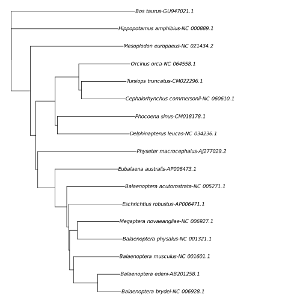
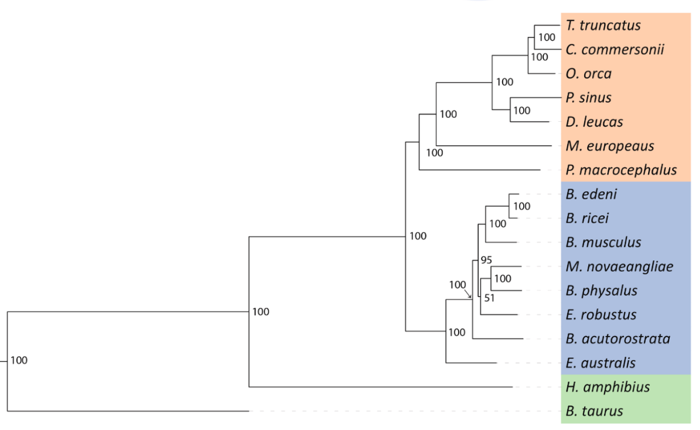

# ncdtree

This is a demo of phylogenetic inference without alignment using the normalized compression distance (NCD) and neighbour-joining.

> [!WARNING]
> This project is for demonstration purposes.

<center>🚧 Work in progress 🚧</center>

## Normalized Compression Distance

Cilibrasi & Vitányi (2005) defined the normalized compression distance ($NCD_Z$) of strings $x$ and $y$ with a compressor $Z$ as:

$$
{NCD}_Z(x, y) = \dfrac{C_Z(xy) - \min(C_Z(x), C_Z(y)) }{\max(C_Z(x), C_Z(y))}
$$

Where $C_Z(\circ)$ is the compressed size of a string with a compressor $Z$, and $xy$ is the concatenation of $x$ and $y$.

## Example: Whale phylogeny

The file **data/whales.fasta** contains unaligned complete mitochondrial genomes of 15 cetaceans and 2 outgroups. The taxon selection replicates the 10,159-locus phylogeny study of [Genty et al. (2024)](https://doi.org/10.1016/j.gene.2024.148822), but I replaced the missing Rice's whale mitochondrial genome with the one from the closely-related Bryde's whale.

All the steps are performed with one command:

```sh
./ncdtree -f data/whales.fasta --stats
```

The program prints some statistics to stdout:

```
COMPRESSOR
==========
Compressor Brotli

COMPRESSION METRICS
===================
#   Taxon                                    Size      CompressedSize  CompressionRatio  SelfNCD   
———————————————————————————————————————————————————————————————————————————————————————————————————
1   Tursiops_truncatus-CM022296.1            16389     4111            3.9866213         0.00122   
2   Orcinus_orca-NC_064558.1                 16392     4134            3.9651669         0.00121   
3   Cephalorhynchus_commersonii-NC_060610.1  16374     4107            3.9868517         0.00146   
4   Mesoplodon_europaeus-NC_021434.2         16343     4378            3.7329831         0.00160   
5   Phocoena_sinus-CM018178.1                16370     4108            3.9849075         0.00146   
6   Physeter_macrocephalus-AJ277029.2        16428     4134            3.9738752         0.00145   
7   Balaenoptera_edeni-AB201258.1            16409     4116            3.9866375         0.00121   
8   Balaenoptera_musculus-NC_001601.1        16402     4125            3.9762424         0.00145   
9   Megaptera_novaeangliae-NC_006927.1       16398     4113            3.9868709         0.00146   
10  Balaenoptera_physalus-NC_001321.1        16398     4116            3.9839650         0.00121   
11  Eschrichtius_robustus-AP006471.1         16413     4117            3.9866408         0.00121   
12  Balaenoptera_acutorostrata-NC_005271.1   16417     4118            3.9866440         0.00121   
13  Eubalaena_australis-AP006473.1           16385     4109            3.9875882         0.00146   
14  Hippopotamus_amphibius-NC_000889.1       16407     4121            3.9813152         0.00097   
15  Bos_taurus-GU947021.1                    16339     4378            3.7320694         0.00091   
16  Balaenoptera_brydei-NC_006928.1          16408     4118            3.9844585         0.00121   
17  Delphinapterus_leucas-NC_034236.1        16386     4110            3.9868613         0.00146   
---------------------------------------------------------------------------------------------------
                                       Mean  16392     4147.8235294    3.953511701886    0.001305  
                                     Median  16398     4118            3.9866213         0.00145   
                                    Minimum  16339     4107            3.7320694         0.00091   
                                    Maximum  16428     4378            3.9875882         0.00160
```

The second and third columns show the size and compressed size (in bytes) of the DNA sequences.

The **CompressionRatio** column is the ratio between the two previous columns. Higher compression ratios yield more accurate NCD estimates.

The column **SelfNCD** shows the computed NCD distance between a sequence and itself. Ideally, the distance between a sequence and itself is 0.0, but this is not achieved because the compression is never perfect.

The default compression algorithm is **Brotli**. It is a general-purpose compressor with optimisations for web-related data. The other available compressor is Gzip. In the data sets that I have tested, I found Brotli to give much better results, with higher compression ratios and much lower SelfNCDs.

The NCD distance matrix was written to the file **ncd_matrix.txt**. Only the lower triangle of the matrix is written, to save space.
```text
Tursiops_truncatus-CM022296.1          
Orcinus_orca-NC_064558.1                0.275036284
Cephalorhynchus_commersonii-NC_060610.1 0.242276818 0.26439284 
Mesoplodon_europaeus-NC_021434.2        0.513476473 0.526039287 0.505025126
Phocoena_sinus-CM018178.1               0.411578691 0.430333817 0.406280428 0.534490635
Physeter_macrocephalus-AJ277029.2       0.532656023 0.539912917 0.529027576 0.548195523 0.552249637
Balaenoptera_edeni-AB201258.1           0.470602527 0.487179487 0.471574344 0.505481955 0.494897959 0.498306725
Balaenoptera_musculus-NC_001601.1       0.477333333 0.486937591 0.480242424 0.498172682 0.505454545 0.499032414 0.250424242
Megaptera_novaeangliae-NC_006927.1      0.479941648 0.490807934 0.474106492 0.504796711 0.498662777 0.494436381 0.279397473 0.268121212
Balaenoptera_physalus-NC_001321.1       0.477162293 0.490566038 0.475218659 0.5061672   0.513605442 0.505321722 0.280369291 0.275878788 0.237123421
Eschrichtius_robustus-AP006471.1        0.480689823 0.493952588 0.472188487 0.502055733 0.508622784 0.483792937 0.290988584 0.281454545 0.280786981 0.293174642
Balaenoptera_acutorostrata-NC_005271.1  0.473045168 0.493468795 0.482758621 0.506395614 0.509470617 0.50822448  0.295046139 0.304484848 0.303788247 0.313987373 0.309373482
Eubalaena_australis-AP006473.1          0.467526149 0.487179487 0.47481139  0.492005482 0.491847165 0.488147073 0.343780369 0.344242424 0.348164357 0.35058309  0.365071654 0.366440019
Hippopotamus_amphibius-NC_000889.1      0.631885465 0.623850992 0.620237806 0.642759251 0.619267168 0.6095791   0.589662703 0.594909091 0.581897598 0.59694249  0.586993448 0.59136132  0.582625576
Bos_taurus-GU947021.1                   0.663088168 0.670854271 0.661946094 0.602329831 0.686614893 0.668570123 0.63796254  0.636592051 0.647555962 0.651210598 0.658291457 0.650296939 0.641845592 0.631566926
Balaenoptera_brydei-NC_006928.1         0.473045168 0.485486212 0.474987858 0.501598904 0.493686255 0.506289308 0.126032054 0.256727273 0.278047596 0.29164643  0.294074794 0.303059738 0.349927149 0.58578015  0.640018273
Delphinapterus_leucas-NC_034236.1       0.395524203 0.408805031 0.390754258 0.520100503 0.409245742 0.540880503 0.486394558 0.495757576 0.486749331 0.490038873 0.487733787 0.491500729 0.479562044 0.627032274 0.651439013 0.488829529
```

The phylogenetic tree shown below was estimated from that distance matrix using the neighbour-joining algorithm. It was written in Newick format to the file **tree.nwk**.



For comparison, the maximum-likelihood phylogeny from 10,159 loci of Genty et al. (2024) is shown below. The two trees mostly agree, but the positions of *Mesoplodon europaeus* (Gervais's beaked whale) and *Physeter macrocephalus* (sperm whale) in the NCD phylogeny are incorrect. The position of *Eschrichtius robustus* (gray whale) is also different in the two trees, but this is not so significant, as the placement of this taxon has low bootstrap support in the tree of Genty el al.



## Usage

### NCD matrix and neighbour-joining tree

Using the program `ncdtree`.

```
usage: ncdtree [-h|--help] [-f|--file "<value>"] [-Z|--compressor
               (Brotli|Gzip)] [-s|--stats] [--notree]

               Estimate a phylogeny from DNA sequences using the normalized
               compression distance (NCD) and neighbour-joining

Arguments:

  -h  --help        Print help information
  -f  --file        File with sequences in FASTA format (read from stdin if
                    none is given)
  -Z  --compressor  Compression algorithm. Default: Brotli
  -s  --stats       Print statistics
      --notree      Do not estimate a tree. Only write out distance matrix.
```

The matrix is written to a file named ncd_matrix.txt, and the tree is written to a file names tree.nwk.

### Neighbour-joining tree directly from a distance file

Get a neighbour-joining tree in Newick format printed to `stdout`.

```sh
./nj <MATRIX>
```

The \<SEQUENCES\> file must contain a distance matrix in plaintext format:

```
taxon_a 	0 	5 	9 	9 	8
taxon_b 	5 	0 	10 	10 	9
taxon_c 	9 	10 	0 	8 	7
taxon_d 	9 	10 	8 	0 	3
taxon_e 	8 	9 	7 	3 	0
```

There must be no header, and the first column must contain the taxon names. The fields are separated by whitespace. Only the lower triangle of the matrix is read. The diagonal and the upper triangle of the matrix can be omitted.

## Build

0. Dependencies:

- Go
- Brotli

1. Clone

```sh
git clone https://github.com/eascarrunz/ncdtree.git
```
   
2. Build

```sh
cd ncdtree
go build ./cmd/ncdtree
go build ./cmd/nj
```

More details soon.